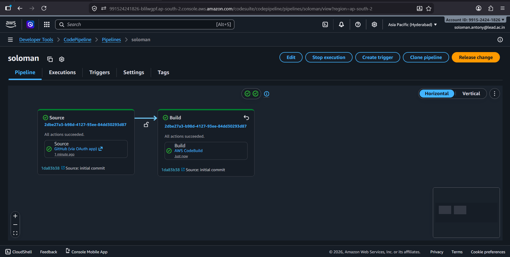
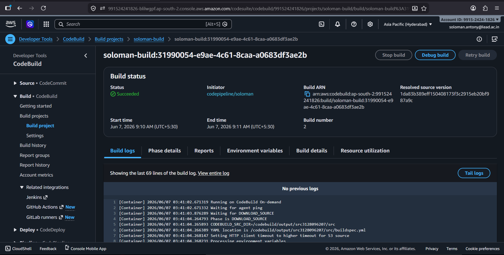
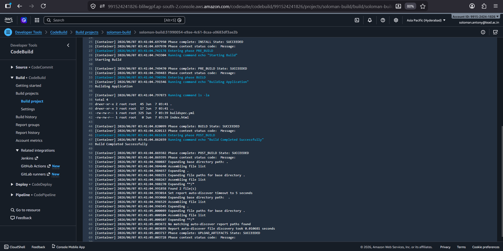

# AWS CI/CD Pipeline using CodePipeline and CodeBuild

## Project Overview

This project demonstrates a simple Continuous Integration and Continuous Delivery (CI/CD) pipeline using AWS CodePipeline and AWS CodeBuild. The pipeline automatically retrieves source code from a GitHub repository and executes a build process defined in a `buildspec.yml` file.

The objective is to automate the software build workflow and verify successful execution through AWS build logs.

---

## Architecture

```text
GitHub Repository
        │
        ▼
AWS CodePipeline
        │
        ▼
AWS CodeBuild
        │
        ▼
Build Logs & Artifacts
```

---

## Technologies Used

- AWS CodePipeline
- AWS CodeBuild
- GitHub
- HTML
- YAML

---

## Project Structure

```text
CODEPIPELINE-CODEBUILD/
│
├── screenshots/
│   ├── build-logs.png
│   ├── build-success.png
│   └── soloman-pipeline.png
│
├── buildspec.yml
├── index.html
└── README.md
```

---

## Sample Application

### index.html

A simple web page used as the sample application for the pipeline.

```html
<!DOCTYPE html>
<html>
<head>
    <title>AWS CI/CD Demo</title>
</head>
<body>
    <h1>CI/CD Pipeline Working Successfully</h1>
</body>
</html>
```

---

## Build Configuration

### buildspec.yml

```yaml
version: 0.2

phases:
  install:
    commands:
      - echo "Installing dependencies"

  pre_build:
    commands:
      - echo "Starting Build"

  build:
    commands:
      - echo "Building Application"
      - ls -la

  post_build:
    commands:
      - echo "Build Completed Successfully"

artifacts:
  files:
    - '**/*'
```

---

## AWS CodeBuild Configuration

| Setting | Value |
|----------|---------|
| Project Name | sample-cicd-build |
| Source Provider | GitHub |
| Environment | Managed Image |
| Operating System | Amazon Linux |
| Runtime | Standard |
| Build Specification | buildspec.yml |

---

## AWS CodePipeline Configuration

| Stage | Configuration |
|---------|--------------|
| Source | GitHub Repository |
| Build | AWS CodeBuild |
| Deploy | Not Configured |

Pipeline Name:

```text
sample-cicd-pipeline
```

---

## Pipeline Execution Steps

1. Developer pushes code to GitHub.
2. AWS CodePipeline detects changes.
3. Source code is fetched from GitHub.
4. AWS CodeBuild starts the build process.
5. Commands defined in `buildspec.yml` are executed.
6. Build logs are generated.
7. Pipeline execution completes successfully.

---

## Build Log Output

Example build output:

```text
Installing dependencies

Starting Build

Building Application

index.html
buildspec.yml

Build Completed Successfully

BUILD SUCCESSFUL
```

---

## Screenshots

### 1. Pipeline Execution



---

### 2. Build Success



---

### 3. Build Logs



---

## Results

- Successfully created an AWS CodePipeline.
- Integrated AWS CodeBuild as the build stage.
- Source code retrieved automatically from GitHub.
- Build process executed successfully using `buildspec.yml`.
- Build logs verified successful completion of all phases.
- CI/CD workflow automated using AWS services.

---

## Conclusion

This project successfully demonstrates the implementation of a basic CI/CD pipeline using AWS CodePipeline and AWS CodeBuild. The pipeline automates source retrieval, build execution, and build monitoring. Such pipelines help improve software delivery speed, reduce manual effort, and ensure consistent build processes in modern DevOps environments.

---

## Author

**Soloman Antony**

AWS | DevOps | Cloud Computing